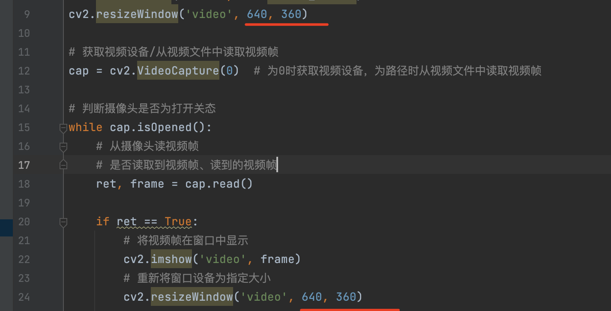
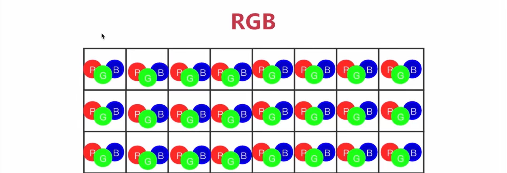
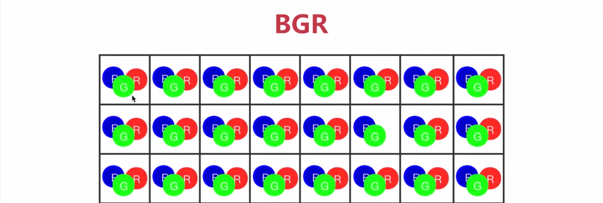
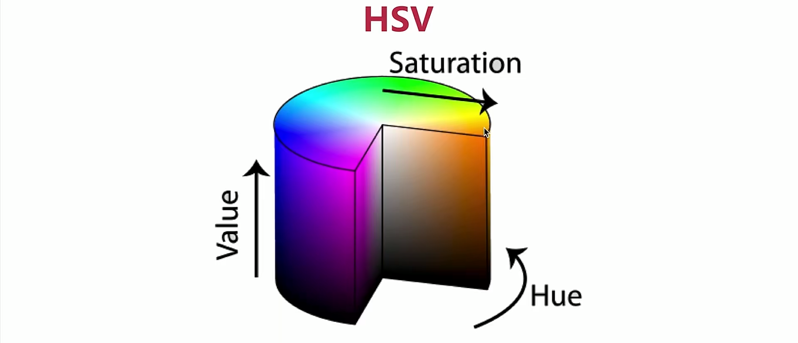
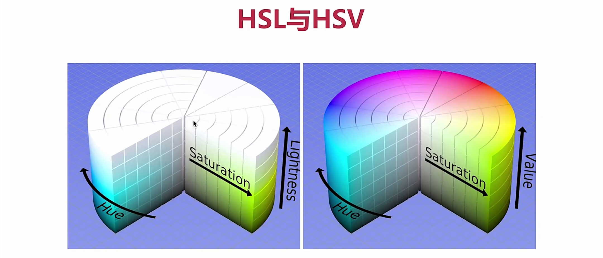
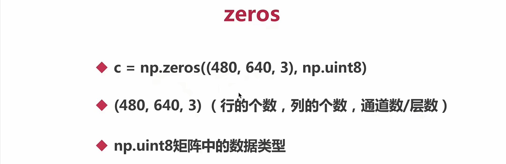
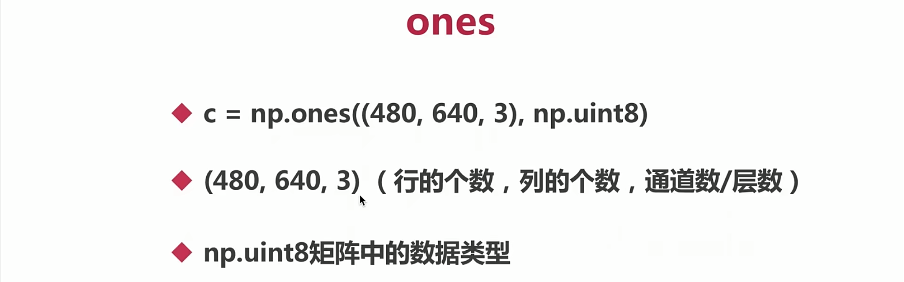
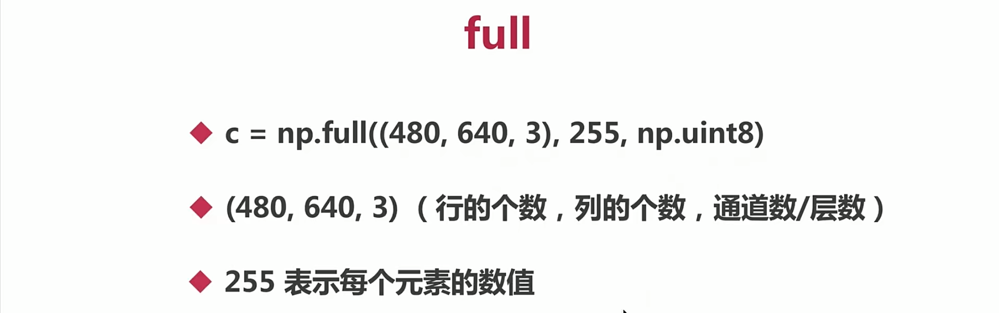
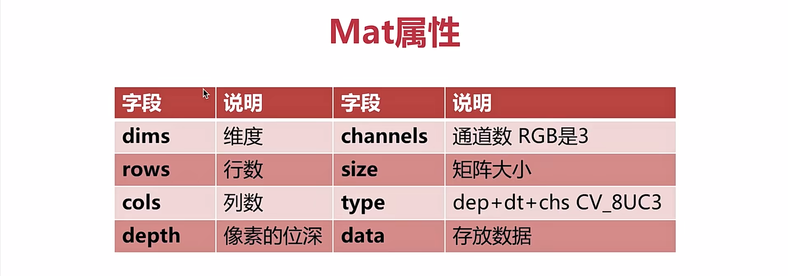

[TOC]


1、创建和显示窗口
===

namedWindow()、imshow()、destroyAllWindows()、resizeWindow() 
---

```python
namedWindow()        //设置窗口名字

imshow()			 			 //显示图片

destroyAllWindows()  //关掉窗口

resizeWindow()  		 //设置窗口大小
```

```python
import cv2

cv2.namedWindow('new', cv2.WINDOW_NORMAL)
cv2.resizeWindow('new', 1920, 1080)
cv2.imshow('new', 0)

key = cv2.waitKey(0) #0 有窗口时，让他一直显示
if(key == 'q'):    
    cv2.destroyAllWindows()
    
    
```

2、加载、显示、保存图片
===

imread、imshow、imwrite 
---

```python
import cv2

cv2.namedWindow('img',cv2.WINDOW_NORMAL)
img = cv2.imread('路径')

cv2.imshow('img',img)#第一个参数为展示图像窗口的名字.第二个参数展示图像窗口中所展示的图像
key = cv2.waitKey(0)

if(key & 0xFF == ord('q')):#key是16位 这里是取key后面的八位看看是否与q相等
  	break
elif(key & 0xFF == ord('s')):
    cv2.imwrite("/Users/gmc/Downloads/opencv/基本操作/124.png", img) #保存文件
else:
    print(key)
    
cv2.destroyAllWindows()
```

3、从摄像头采集视频、读取视频帧、视频录制 
===

视频录制 videoWriter、write、release
---

```python
import cv2

# 创建VideoWriter为写多媒体文件
fourcc = cv2.VideoWriter_fourcc(*'MJPG')
vw = cv2.VideoWriter('./qqq.mp4', fourcc, 25, (1280, 720))

# 创建窗口
cv2.namedWindow('video', cv2.WINDOW_NORMAL)
cv2.resizeWindow('video', 640, 360)

# 获取视频设备/从视频文件中读取视频帧
cap = cv2.VideoCapture(0)  # 为0时获取视频设备，为路径时从视频文件中读取视频帧

# 判断摄像头是否为打开关态
while cap.isOpened():
    # 从摄像头读视频帧
    # 是否读取到视频帧、读到的视频帧
    ret, frame = cap.read()
    
    if ret == True:
        # 将视频帧在窗口中显示
        cv2.imshow('video', frame)
        # 重新将窗口设备为指定大小
        cv2.resizeWindow('video', 640, 360)

        # 写数据到多媒体文件
        vw.write(frame)

        # 等待键盘事件，如果为q，退出
        key = cv2.waitKey(1) # 这里不能设为0，必须要大于0，不然不能显示, 播放视频时这里设为40
        if (key & 0xFF == ord('q')):
            break
    else:
        break

# 释放VideoCapture
cap.release()

# 释放VideoWriter
vw.release()

# vw.release()
cv2.destroyAllWindows()
```

代码优化?
---



4、控制鼠标
===

setMouseCallback(winname,callback,userdata) 
---

callback(event,x,y,flag,userdata)
---

```python
# 窗口的名字,自己定义的回调函数，在设置的回调函数里传递的参数
setMouseCallback(winname,callback,userdata) 

# 鼠标点击事件(鼠标移动、按下左键)，鼠标所在位置，flags鼠标键及组合键
callback(event,x,y,flag,userdata)
```

```python
import cv2
import numpy as np

# 鼠标回调函数
def mouse_callback(event, x, y, flags, userdata):
    print(event, x, y, flags, userdata)

# mouse_callback(1, 100, 100, 16, "666")

# 创建窗口
cv2.namedWindow('mouse', cv2.WINDOW_NORMAL)
cv2.resizeWindow('mouse', 640, 360)

# 设置鼠标回调
cv2.setMouseCallback('mouse', mouse_callback, "123")

# 显示窗口和背景
img = np.zeros((360, 640, 3), np.uint8)
while True:
    cv2.imshow('mouse', img)
    key = cv2.waitKey(1)
    if key & 0xFF == ord('q'):
        break

cv2.destroyAllWindows()
```

5、TrackBar控件
===

createTrackbar参数
---

### trackbarname、winname、value、count、callback、userdata

trackbarname， 控件的名字

winname，		  窗口的名字

value，				 trackbar当前值

count，				拖动的值

callback，

userdata

getTrackbar参数
---

### trackbarname、winname、输出当前值

TrackBar的使用
---

```python
import cv2
import numpy as np

def callback():
    pass

#创建窗口
cv2.namedWindow('trackbar', cv2.WINDOW_NORMAL)

#创建trackbar
cv2.createTrackbar('R', 'trackbar', 0, 255, callback)
cv2.createTrackbar('G', 'trackbar', 0, 255, callback)
cv2.createTrackbar('B', 'trackbar', 0, 255, callback)

#创起家一个背景图片
img = np.zeros((480, 640, 3), np.uint8)

while True:
    
    #获取当前trackbar的值
    r = cv2.getTrackbarPos('R', 'trackbar')
    g = cv2.getTrackbarPos('G', 'trackbar')
    b = cv2.getTrackbarPos('B', 'trackbar')

    #改变背景图片颜色
    img[:] = [b, g, r]
    cv2.imshow('trackbar', img)

    key = cv2.waitKey(10)
    if key & 0xFF == ord('q'):
        break


cv2.destroyAllWindows()
```

6、色彩空间
===

RGB与BGR（用在显示器，硬件中）
---

RGB 人眼的色彩空间



OpenCV默认使用BGR



HSV/HSB/HSL
---

### HSV（用在opencv中，重要）

#### Hue、Saturation、Value



Hue:色相，即色彩，如红色，蓝色

Saturation：饱和度，颜色的纯度

Value：明度

### HSL

#### Hue、Saturation、Ligthness

Hue:色相，即色彩，如红色，蓝色

Saturation：饱和度，颜色的纯度

Ligthness：亮度


YUV（用在视频中）
---

Y代表灰色的图像，UV代表颜色

### **YUV4:2:0**（常用）

### YUV4:2:2

### YUV4:4:4

色彩空间转换实战
---

```python
import cv2

def callback(userdata):
    pass

cv2.namedWindow('color', cv2.WINDOW_NORMAL)

img = cv2.imread('./RMB.jpeg')

colorspaces = [cv2.COLOR_BGR2RGBA, cv2.COLOR_BGR2BGRA, 
               cv2.COLOR_BGR2GRAY, cv2.COLOR_BGR2HSV, 
               cv2.COLOR_BGR2YUV]
cv2.createTrackbar('curcolor', 'color', 0, 4, callback)

while True:
    index = cv2.getTrackbarPos('curcolor', 'color')

    #颜色空间转换API
    cvt_img = cv2.cvtColor(img, colorspaces[index])

    cv2.imshow('color', cvt_img)
    key = cv2.waitKey(10)
    print(key)
    if key & 0xFF == ord('q'):
        break

cv2.destroyAllWindows()
```

7、Numpy
===

Opencv中用到的矩阵都要转化成Numpy数组
---

Numpy基本操作(ROI)
---

### 创建矩阵、检索与赋值[y,x]、获取子数组[:,:]

Numpy创建矩阵
---

### 创建数组array()、创建全0数组zeros()/ones、创建全值数组full()、创建单元数组identity/eye()

创建数组array()


创建全0数组zeros()/ones






创建全值数组full()




创建单元数组identity/eye()


Numpy检索与赋值[y,x]
---

### [y,x]

### [y,x,channel]  BGR，RGB要加通道数，有颜色为3 灰色为1

Numpy获取子矩阵[:,:] 获取图像中的区域
---

### [y1:y2,x1:x2]

### [:,:]


代码实现
---

```python
import numpy as np
import cv2

#通过array定义矩阵
# a = np.array([1,2,3])
# b = np.array([[1, 2, 3], [4, 5, 6]])

# print(a)
# print(b)

#定义zeros矩阵
img = np.zeros((480, 640, 3), np.uint8)
#print(c)

#定义ones矩阵
#d = np.ones((8,8), np.uint8)
#print(d)

#定义full矩阵
# e = np.full((8,8), 10, np.uint8)
# print(e)

#定义单位矩阵identity
# f = np.identity(8)
# print(f)

# g= np.eye(5, 7, k=1)
# print(g)

# print(img[100, 80])

# count = 0
# while count < 200:
#     img[count, 80, 0] = 255
#     count = count + 1

#从矩阵中读某个元素的值
# print(img[100, 100])
# count = 0

# #向矩阵中某个元素赋值
# while count < 200:
#     #BGR
#     img[count, 100] = [255, 255, 255]
#     count = count + 1

roi = img[100:400, 100:600]
#roi[:,:] = [0,0,255]
roi[:] = [0,0,255]
roi[:,10] = [0,0, 0]
roi[10:200,10:200] = [0,255,0]

cv2.imshow('img', roi)
key = cv2.waitKey(0)
if key & 0xFF == ord('q'):
    cv2.destroyAllWindows()
```

Mat
===




Mat拷贝

通道分离和合并
===

split(mat)
---

merge((ch1, ch2, ...))
---
