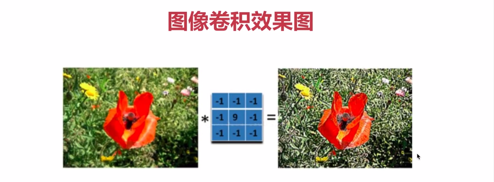
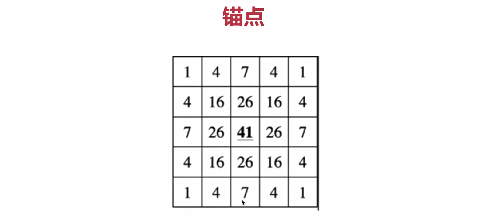
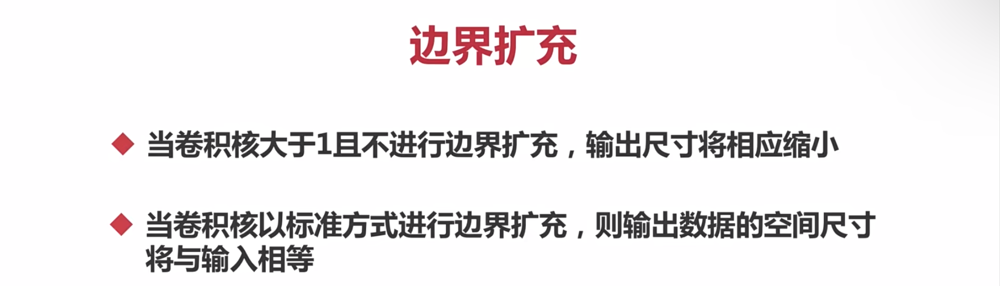
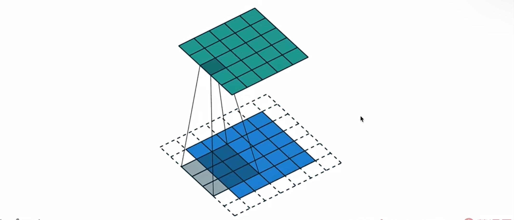
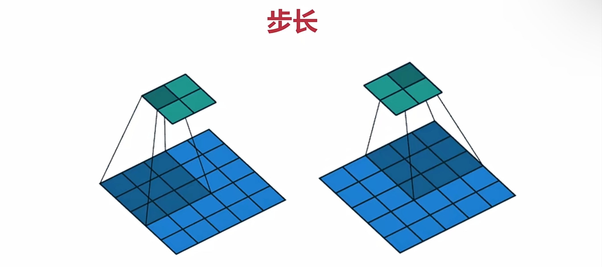
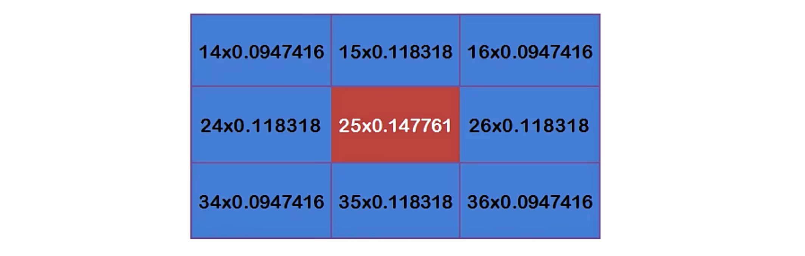
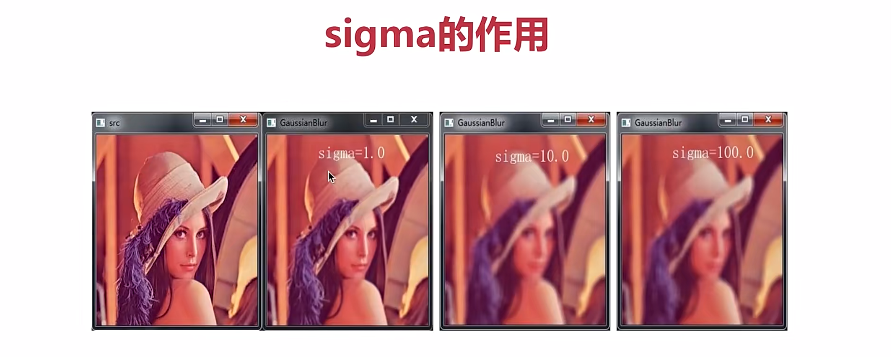
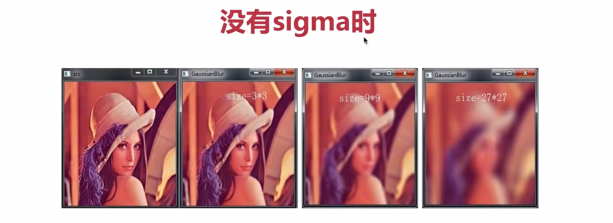
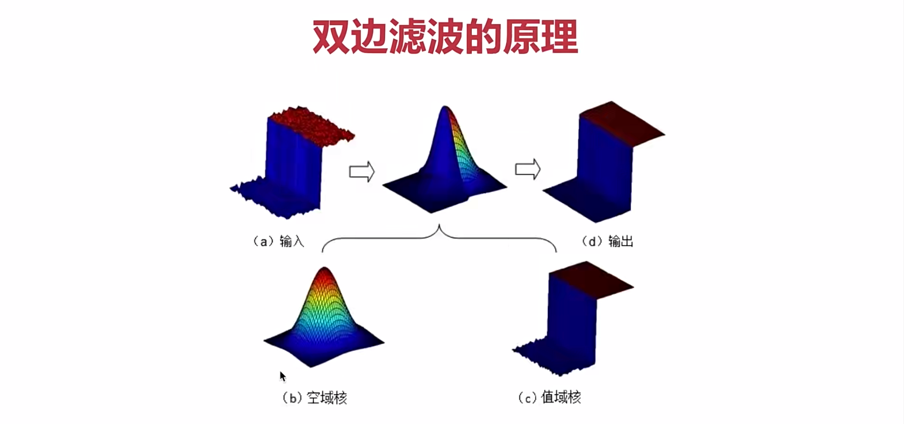
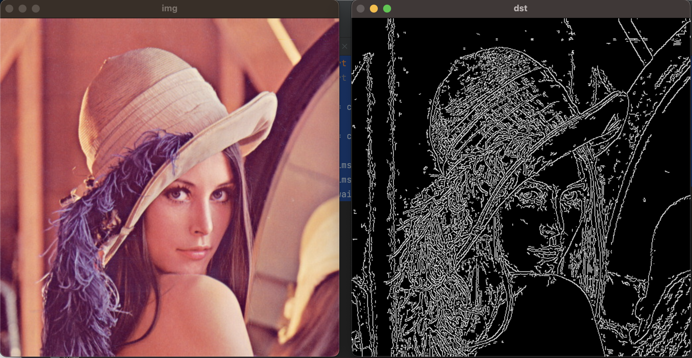

[TOC]


1、图像滤波
===

一幅图像通过滤波器得到另一幅图像，滤波器又被称为卷积核，滤波的过程称为卷积



2、卷积相关概念
===

卷积核的大小
---

卷积核为奇数，如3X3    5X5   7X7等，一方面是增加padding的原因，另一方面是保证锚点在中间，放置位置发生偏移的原因

### 卷积核大小影响

在深度学习中，卷积核越大，看到的信息(感受野)越多，提取的特征越好，同时计算量也越大

锚点
---



边界扩充
---

### 计算公式  N=(W-F+2P)/S+1







步长
---

步长为2时



低通滤波与高通滤波
---

低通滤波可以去除噪音或平滑图像

高通滤波可以帮助查找图像的边缘

实战--图像卷积
---

filter2D(src，ddepth，kernel，anchor，delta，borderType）

kernel卷积核   borderType边界类型

将图片变得平滑

```python
import cv2
import numpy as np

img = cv2.imread('./papper.png')

kernel = np.ones((5,5), np.float32) / 25
dst = cv2.filter2D(img, -1, kernel)

cv2.imshow('dst', dst)
cv2.imshow('img', img)
cv2.waitKey(0)
```

3、低通滤波（主要作用是去噪）
===

代码实现

```python
import cv2
import numpy as np

img = cv2.imread('./papper.png')

# kernel = np.ones((5,5), np.float32) / 25
# dst = cv2.filter2D(img, -1, kernel)

#均值滤波
#dst  = cv2.blur(img, (5, 5))
#高斯滤波
#dst = cv2.GaussianBlur(img, (5,5), sigmaX=1)
#中值滤波
#dst = cv2.medianBlur(img, 5)
#双边滤波
dst =cv2.bilateralFilter(img, 7, 20, 50)

cv2.imshow('dst', dst)
cv2.imshow('img', img)
cv2.waitKey(0)
```

1 方盒滤波与均值滤波
---

### **一般都是使用的均值滤波，当normalize==true时，方盒滤波==平均滤波**

 ksize是3X3还是5X5

### 1）方盒滤波：boxFilter（src，ddepth，ksize，anchor，normalize，borderType）


### 2）均值滤波：blur（src，ksize，anchor，borderType）

### 2 高斯滤波（主要解决高斯噪音的问题）

经过高斯滤波噪点会变得模糊不会那么清晰，他的边缘点，边也会变模糊

### sigma越大越模糊

### GaussianBlur（img，kernel，sigmaX，sigmaY，...)

sigmaX到中心点，x轴的误差有多大

### 高斯权重







3  中值滤波（对胡椒噪音效果明显）
---

### medianBlur（img，ksize）

胡椒噪音：其中黑色的噪声点称为*胡椒噪声*(pepper noise),而白色的噪声点就被称为盐噪声(salt noise)

假设有一个数组[1556789]，取其中的中间值作为卷积后的结果值

4  双边滤波(进行美颜，可以保留边缘，同时可以对边缘内的区域进行平滑处理)
---

d直径，

### bilateralFilter(img,d,sigmaColor,sigmaSpace,...)

### 双边滤波的原理



5、高通滤波（检测边缘）
===

1) 边缘检测Canny（重要！！！）
---

### **Canny(img，minVal，maxVal，...)**

### 使用5X5高斯滤波消除噪声，然后调用索贝尔来计算图像梯度的方向(0度/45度/90度/135度)，取局部极大值，进行阈值计算

```python
import cv2
import numpy as np

img = cv2.imread('./lena.png')

dst = cv2.Canny(img, 50, 80)

cv2.imshow('img', img)
cv2.imshow('dst', dst)
cv2.waitKey(0)
```



2) Sobel(索贝尔)(高斯)（一般使用这个）
---

### Sobel(src,ddepth,dx,dy,ksize=3,scale=1,delta=0,borderType=border_default)

先向x方向求导

然后在y方向求导

最终结果：|G|=|Gx|+|Gy|

3) Scharr(沙尔)（一般不使用）不能改变卷积核大小
---

这两个在计算边缘时只能求一个方向，要么是横轴，要么是纵轴，我们要调用加法运算才能得出结果

4) Laplacian（拉普拉斯）对噪音比较敏感，无降噪功能
---

```python
import cv2
import numpy as np

img = cv2.imread('./chess.png')

#索贝尔算子y方向边缘
#d1 = cv2.Sobel(img, cv2.CV_64F, 1, 0, ksize=5)
#沙尔
#d1 = cv2.Scharr(img, cv2.CV_64F, 1, 0)
#索贝尔算子x方向边缘
#d2 = cv2.Sobel(img, cv2.CV_64F, 0, 1, ksize=5)
#沙尔
#d2 = cv2.Scharr(img, cv2.CV_64F, 0, 1)

#拉普拉斯
ldst = cv2.Laplacian(img, cv2.CV_64F, ksize=5)

#dst = d1 + d2
#dst = cv2.add(d1, d2)

cv2.imshow('img', img)
# cv2.imshow('d1', d1)
# cv2.imshow('d2', d2)
# cv2.imshow('dst', dst)
cv2.imshow('ldst', ldst)
cv2.waitKey(0)
```