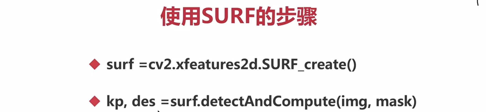

[TOC]


1、特征检测的基本概念
===

opencv特征的场景：图像搜索，拼图游戏，图像拼接
---

拼图方法：寻找特征，特征是唯一的，可追踪的，能比较的


2、Harris角点检测
===

blockSize检测窗口大小，ksize Sobel的卷积核  权重系数一般在0.02~0.04之前，一般取0.04

```python
import cv2
import numpy as np

#harris
# blockSize = 2
# ksize = 3
# k = 0.04

#Shi-Tomasi
maxCorners = 1000
ql = 0.01
minDistance = 10

img = cv2.imread('chess.png')

#灰度化
gray = cv2.cvtColor(img, cv2.COLOR_BGR2GRAY)

#Harris角点检测
#dst = cv2.cornerHarris(gray, blockSize, ksize, k)
corners = cv2.goodFeaturesToTrack(gray, maxCorners, ql, minDistance)
corners = np.int0(corners)

#Harris角点的展示
#img[dst>0.01*dst.max()] = [0,0,255]

#Shi-Tomasi绘制角点
for i in corners:
    x,y = i.ravel()
    cv2.circle(img, (x,y), 3, (255,0,0), -1)

cv2.imshow('harris', img)
cv2.waitKey(0)
```

1）哈里斯角点检测
---

### cornerHarris(img，dst，blockSize，ksize，k)


2）Shi-Tomasi角点检测
---

Harris角点检测的稳定性和k有关，而k是个经验值，不好设定最佳值，所以有这个Shi-Tomasi角点检测

### goodFeaturesToTrack(img,maxCorners，...)

- maxCorners:角点的最大值，值为0表示无限制；
- qualityLevel：小于1.0的正数，一般在0.01-0.1之间
- minDistance：角之间最小欧式距离，忽略小于此距离的点
- mask：感兴趣的区域
- blocksize：检测窗口
- useHarrisDetector：是否使用Harris算法
- k：默认是0.04

3、SIFT关键点检测
===

Scale-Invariant Feature Transform

与缩放无关的特征转换

SIFT出现的原因
---

Harris角点具有旋转不变的特性，但缩放后，原来的角点有可能就不是角点了

使用SIFT的步骤
---

- 创建SIFT对象
- 进行检测，kp=sift.detect(img，...)
- 绘制关键点，drawKeypoints(gray，kp，img)

1）通过SIFT计算描述子（作用是进行特征匹配）
---

### kp,des=sift.compute(img，kp)

定义：记录了关键点周围对其有贡献的像素点的一组向量值，其不受放射变换，光照变换等影响

关键点：位置，大小和方向

2）同时计算关键点和描述（！！！一般用这个）
---

### kp,des=sift.detectAndCompute(img,...)  

mask：指明对img中哪个区域进行计算

4、SURF特征检测  优点：速度快
===

使用SURF的步骤
---



5、ORB特征检测（可做到实时检测）(降低了计算准确率) 无版权问题
===

ORB=Oriented FAST + Rotated BRIEF
---

FAST可做到特征点的实时检测

BRIEF是对已检测到的特征点进行描述，它加快了特征描述符建立的速度，同时极大的降低了特征匹配的时间

使用ORB的步骤
---


6、暴力特征匹配
===


以上代码实现
===

```python
import cv2
import numpy as np

#读文件
#img = cv2.imread('chess.png')
img1 = cv2.imread('opencv_search.png')
img2 = cv2.imread('opencv_orig.png')

#灰度化
#gray = cv2.cvtColor(img, cv2.COLOR_BGR2GRAY)
g1 = cv2.cvtColor(img1, cv2.COLOR_BGR2GRAY)
g2 = cv2.cvtColor(img2, cv2.COLOR_BGR2GRAY)

#创建sift对象
sift = cv2.xfeatures2d.SIFT_create()

#创建surf对象
#surf = cv2.xfeatures2d.SURF_create()

#创建ORB对象
#orb = cv2.ORB_create()

#进行检测
#kp, des = sift.detectAndCompute(gray, None)
kp1, des1 = sift.detectAndCompute(g1, None)
kp2, des2 = sift.detectAndCompute(g2, None)

#使用surf进行检测
#kp, des = surf.detectAndCompute(gray, None)

#orb进行检测
#kp, des = orb.detectAndCompute(gray, None)

#绘制keypoints
#cv2.drawKeypoints(gray, kp, img)

bf = cv2.BFMatcher(cv2.NORM_L1)
match = bf.match(des1, des2)

img3 = cv2.drawMatches(img1, kp1, img2, kp2, match, None)

#cv2.imshow('img', img)
cv2.imshow('img3', img3)

cv2.waitKey(0)
```


7、FLANN特征匹配(在进行批量特征匹配时，FLANN速度更快)（临近近似值，精度较差）
===


8、图像查找(特征匹配+单应性矩阵)
===


以上代码实现
===

```python
import cv2
import numpy as np

#打开两个文件
img1 = cv2.imread('opencv_search.png')
img2 = cv2.imread('opencv_orig.png')

#灰度化
g1 = cv2.cvtColor(img1, cv2.COLOR_BGR2GRAY)
g2 = cv2.cvtColor(img2, cv2.COLOR_BGR2GRAY)

#他建SIFT特征检测器
sift = cv2.xfeatures2d.SIFT_create()

#计算描述子与特征点
kp1, des1 = sift.detectAndCompute(g1, None)
kp2, des2 = sift.detectAndCompute(g2, None)

#创建匹配器
index_params = dict(algorithm = 1, trees = 5)
search_params = dict(checks = 50)
flann = cv2.FlannBasedMatcher(index_params, search_params)

#对描述子进行匹配计算
matchs = flann.knnMatch(des1, des2, k=2)

good = []
for i, (m, n) in enumerate(matchs):
    if m.distance < 0.7 * n.distance:
        good.append(m)


if len(good) >= 4:
    srcPts = np.float32([kp1[m.queryIdx].pt for m in good]).reshape(-1, 1, 2)
    dstPts = np.float32([kp2[m.trainIdx].pt for m in good]).reshape(-1, 1, 2)
    
    H, _ = cv2.findHomography(srcPts, dstPts, cv2.RANSAC, 5.0)

    h, w = img1.shape[:2]
    pts = np.float32([[0,0], [0, h-1], [w-1, h-1], [w-1, 0]]).reshape(-1, 1, 2)
    dst = cv2.perspectiveTransform(pts, H)

    cv2.polylines(img2, [np.int32(dst)], True, (0, 0, 255))
else:
    print('the number of good is less than 4.')
    exit()


    
ret = cv2.drawMatchesKnn(img1, kp1, img2, kp2, [good], None)
cv2.imshow('result', ret)
cv2.waitKey()
```