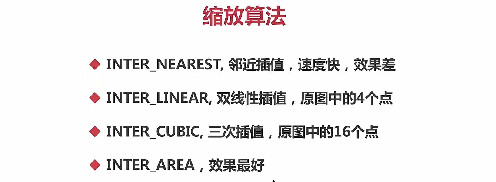
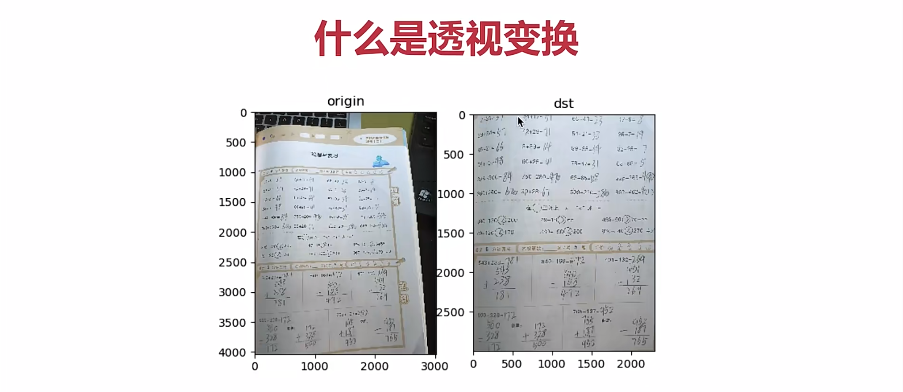

[TOC]


1、图像放大与缩小
===

fx：x轴的缩放因子  fy：y轴的缩放因子   interpolation插值算法

resize（src，dst，dsize，fx，fy，interpolation）
---

```python
import cv2
import numpy as np

dog = cv2.imread('./dog.jpeg')
#dsize (x,y)
new = cv2.resize(dog,None, fx=0.3, fy=0.3, interpolation=cv2.INTER_AREA)

print(dog.shape)

cv2.imshow('dog', dog)
cv2.imshow('new', new)
cv2.waitKey(0)
```



2、图像的翻转
===

flipCode==0，上下   flipCode>0，左右    flipCode<0，上下+左右

flip（img，flipCode） 
---

3、图像的旋转
===

ROTATE_90_CLOCKWISE，顺时针90度旋转

ROTATE_180_ 顺时针180度旋转

ROTATE_90_COUNTERCLOCKWISE，顺时针90度旋转

rotate（img，rotateCode）
---

```python
import cv2
import numpy as np

dog = cv2.imread('./dog.jpeg')
new = cv2.rotate(dog, cv2.ROTATE_90_CLOCKWISE)
new2 = cv2.rotate(dog, cv2.ROTATE_180)

cv2.imshow('dog', dog)
cv2.imshow('new', new)
cv2.imshow('new2', new2)
cv2.waitKey(0)
```

4、仿射变换
===

定义：图像旋转、缩放、平移的总称
---

M变换矩阵     dsize输出尺寸大小      flags与resize中插值算法一致       mode边界外推法标志	   value充边界的值

warpAffine（src，M，dsize，flags，mode，value）
---

4.1 图像平移
---

4.2 变换矩阵
---

center 中心点  angle 旋转多大的角度(逆时针)      scale 缩放比例

### 获取变换矩阵  getRotationMatrix2D（center，angle，scale）

### getAffineTransform(src, dst)

```python
import cv2
import numpy as np

dog = cv2.imread('./dog.jpeg')
h, w, ch = dog.shape
#M = np.float32([[1, 0, 500], [0, 1, 300]])  # 2*3的矩阵
# 旋转的角度为逆时针
# 中心点是 (x,y)
#M = cv2.getRotationMatrix2D((w/2, h/2), 15, 1.0) #改变窗口大小
src = np.float32([[400, 300], [800, 300], [400, 1000]]) 
dst = np.float32([[200, 400], [600, 500], [150, 1100]])
M = cv2.getAffineTransform(src, dst)

#如果想改变新图像的尺寸，需要修改dsize
new = cv2.warpAffine(dog, M, (w, h))

print(dog.shape)

cv2.imshow('dog', dog)
cv2.imshow('new', new)
cv2.waitKey
```

5、透视变换
===

将一种坐标系变换成另外一种坐标系
---

M 变换矩阵   dsize 目标图像大小

warpPerspective(img，M，dsize，...)  (这里需要获取四个角的位置)
---



```PYTHON
import cv2
import numpy as np

img = cv2.imread('2.jpeg')

src = np.float32([[100, 1100], [2100, 1100], [0, 4000,], [2500, 3900]])
dst = np.float32([[0, 0], [2300, 0], [0, 3000], [2300, 3000]])
M = cv2.getPerspectiveTransform(src, dst)

new = cv2.warpPerspective(img, M, (2300, 3000))

cv2.imshow('orgin', img)
cv2.imshow('new', new)
cv2.waitKey(0)
cv2.imwrite('./math.png', new)
```