[TOC]


1、形态学概述
===

基于图像形态进行处理的一些基本方法

这些处理方法基本是对二进制图像进行处理

卷积核决定着图像处理后的效果

图像学图像处理
---

### 腐蚀与膨胀

### 开运算，先腐蚀再膨胀

### 闭运算，先膨胀再腐蚀

2、图像全局二值化
===

将图像的每个像素变成只有两种两种值，如0,255

全局二值化   threshold(img，thresh，maxVal，type) thresh阈值，maxVal超过阈值，替换成maxVal
---

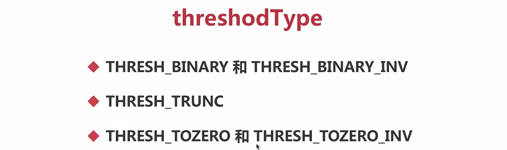

```python
import cv2
import numpy as np

img = cv2.imread('./math.png')
img1 = cv2.cvtColor(img, cv2.COLOR_BGR2GRAY)

ret, dst = cv2.threshold(img1, 180, 255, cv2.THRESH_BINARY_INV)
print(dst.shape)

cv2.imshow('img', img)
cv2.imshow('gray', img1)
cv2.imshow('bin', dst)

cv2.waitKey(0)
```

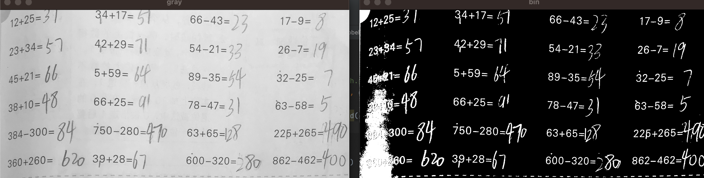

局部二值化

3、阈值类型
===

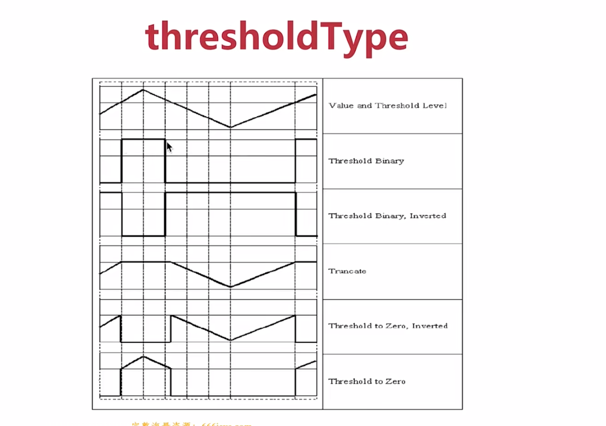

4、自适应阈值二值化
===

由于光照不均匀以及阴影的存在，只有一个阈值会使得在阴影处的白色被二值化成黑色，这种需要用自适应的方法

adaptiveThreshold(img，maxVala，daptiveMethod，type，blockSize，C)
---

blockSize：临近区域的大小

C：常量，应从计算出的平均值或加权平均值中减去

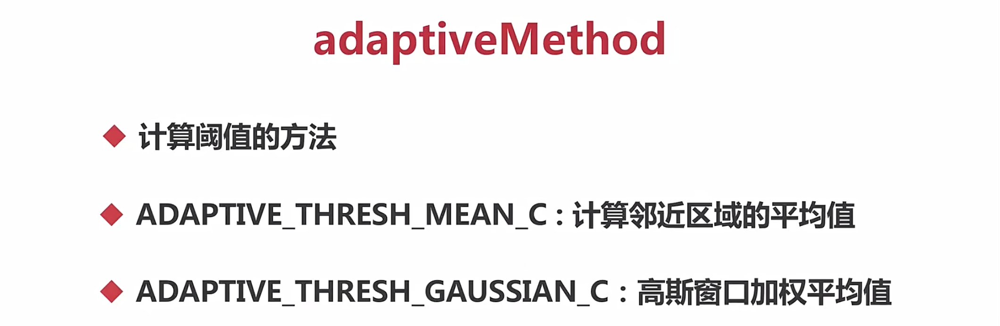

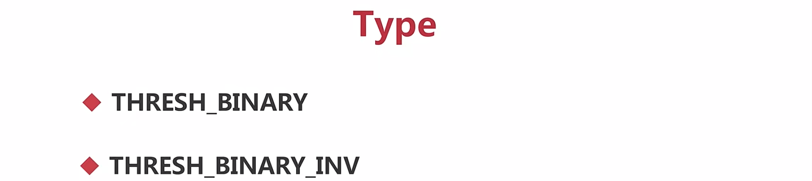

```python
import cv2
import numpy as np

img = cv2.imread('./math.png')
img1 = cv2.cvtColor(img, cv2.COLOR_BGR2GRAY)

dst = cv2.adaptiveThreshold(img1, 255, cv2.ADAPTIVE_THRESH_GAUSSIAN_C, 
                                        cv2.THRESH_BINARY, 11, 0)
print(dst.shape)

cv2.imshow('img', img)
cv2.imshow('gray', img1)
cv2.imshow('bin', dst)

cv2.waitKey(0)
```

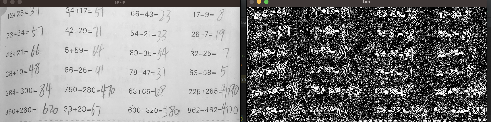

5、OpenCV腐蚀(卷积核越大，腐蚀效果越明显)
===

erode(img,kernel,iterations=1)
---

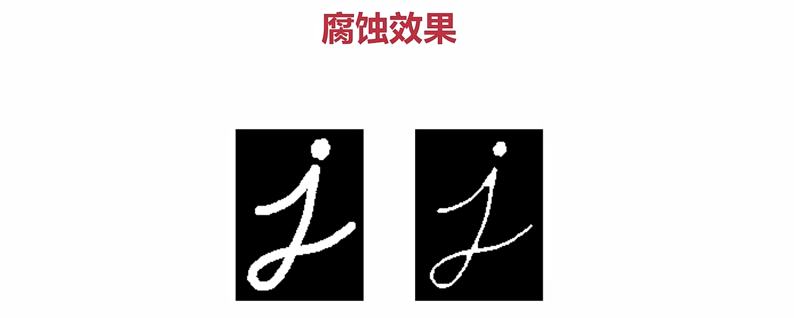

留下中心点

6、获取形态学卷积核
===

getStructuringElement(type，size)  Size值为:(3，3)、(5,5) ...

rect矩形，ellipse椭圆形，cross交叉

7、OpenCV膨胀
===

dilate(img，kernel，iterations=1)
---

8、开运算=腐蚀+膨胀(去掉大图形外面噪点)
===

morphologyEx(img，MORPH_OPEN，kernel)
---


9、闭运算（将里面的噪点消除掉）
===

morphologyEx(img，MORPH_CLOSE，kernel)
---

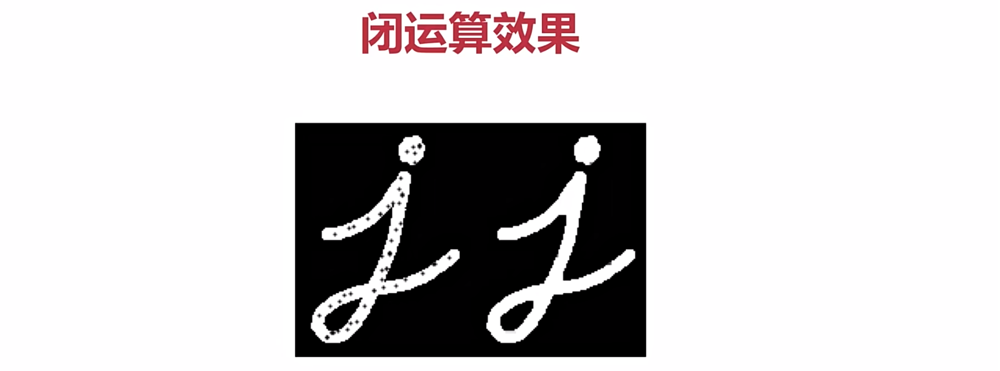

10、形态学梯度（梯度=原图-腐蚀）(求边缘)
===

morphologyEx(img，MORPH_GRADIENT，kernel)
---

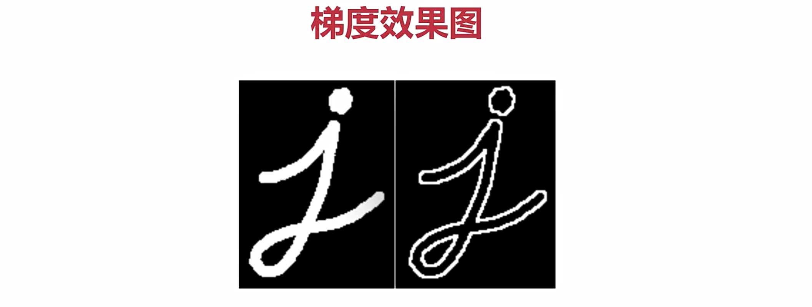


11、顶帽运算(顶帽=原图-开运算)（得到大图形外的小图形）
===


---

morphologyEx(img，MORPH_TOPHAT，kernel)
---


12、黑帽操作（黑帽=原图-闭运算）（得到大图形内的小图形）
===

morphologyEx(img，MORPH_BLACKHAT，kernel)
---

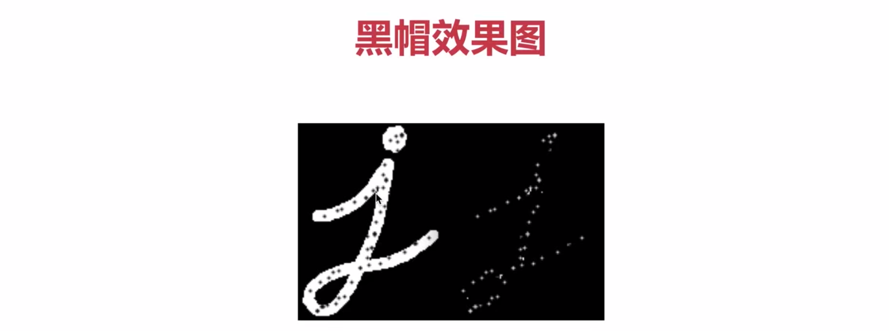


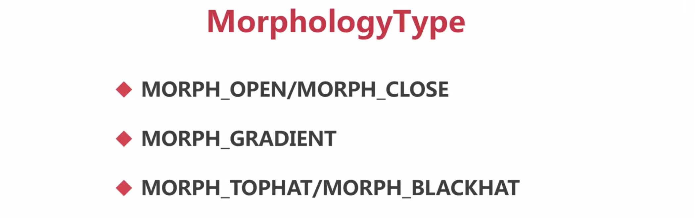


代码实现
===

```python
import cv2
import numpy as np

#开操作
#img = cv2.imread('./dotj.png')
#闭操作
img = cv2.imread('./dotinj.png', 0)
#梯度操作
#img = cv2.imread('./dotinj.png')
#顶帽操作
# img = cv2.imread('./tophat.png')


#kernel = np.ones((7,7), np.uint8)
kernel = cv2.getStructuringElement(cv2.MORPH_RECT, (7, 7))
# print(kernel)
#dst = cv2.erode(img, kernel, iterations=1)

#膨胀
#dst1 = cv2.dilate(dst, kernel, iterations=1)

#开运算
#dst1 = cv2.morphologyEx(img, cv2.MORPH_OPEN, kernel)

#闭运算
#dst1 = cv2.morphologyEx(img, cv2.MORPH_CLOSE, kernel)

#梯度
# dst1 = cv2.morphologyEx(img, cv2.MORPH_GRADIENT, kernel)

#顶帽
# dst1 = cv2.morphologyEx(img, cv2.MORPH_TOPHAT, kernel)
# 黑帽
# dst1 = cv2.morphologyEx(img, cv2.MORPH_BLACKHAT, kernel)

ret,binary=cv2.threshold(img,0,255,cv2.THRESH_BINARY)
dst1 = cv2.ximgproc.thinning(binary,thinningType=cv2.ximgproc.THINNING_ZHANGSUEN)

cv2.imshow('img', img)
cv2.imshow('binary', binary)
cv2.imshow('dst1', dst1)
cv2.waitKey()
```