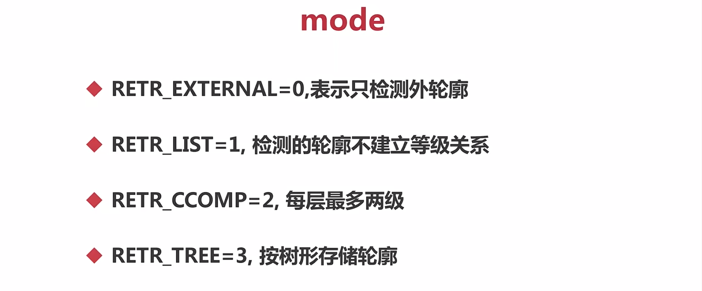
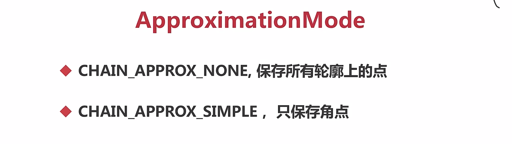
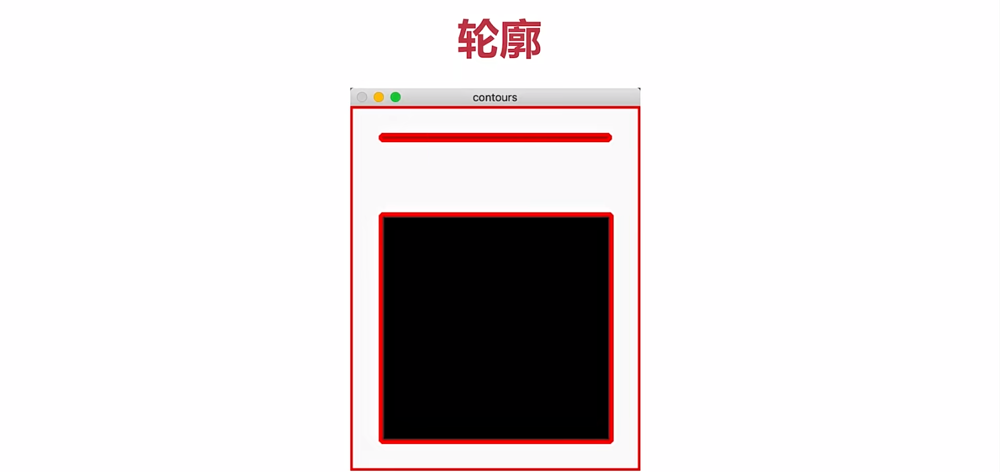
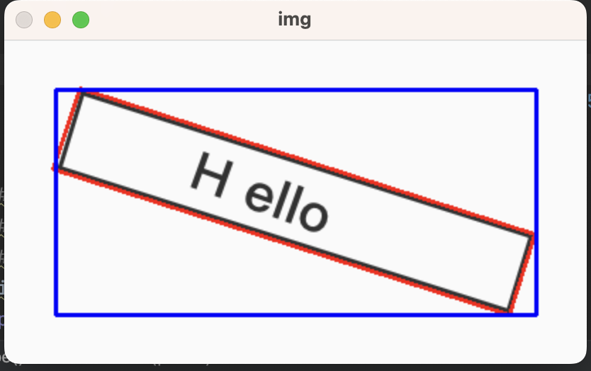
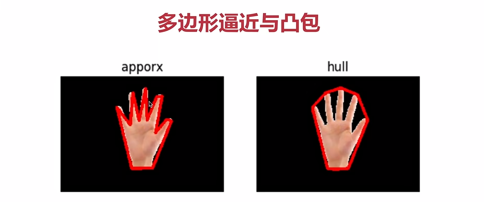
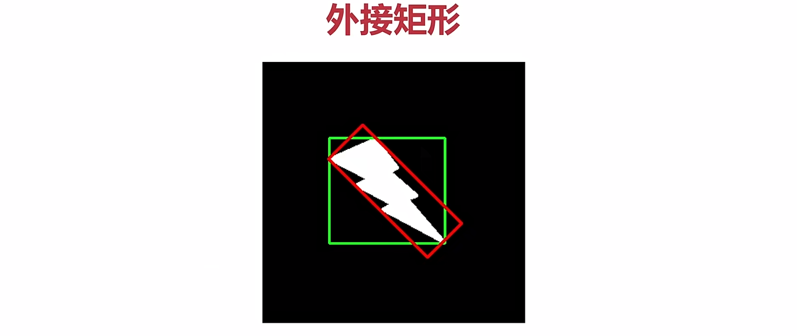

[TOC]


1、什么是图像轮廓
===

具有相同颜色或强度的连续点的曲线

轮廓查找 findContours(img，
---

										   mode，
---

										   ApproximationMode...)
---









轮廓的作用：用于图形分析，物体的识别与检测
---

注意：为了准确性，要先进行二值化或Canny操作
---

画轮廓时会修改输入的图像

2、查找轮廓
===

```python
import cv2
import numpy as np

def drawShape(src, points):
    i = 0
    while i < len(points):
        if(i == len(points) - 1):
            x,y = points[i][0]
            x1,y1 = points[0][0]
            cv2.line(src, (x, y), (x1, y1), (0, 0, 255), 3)
        else:
            x,y = points[i][0]
            x1,y1 = points[i+1][0]
            cv2.line(src, (x, y), (x1, y1), (0, 0, 255), 3)
        i = i + 1

#读文件
#img = cv2.imread('./contours1.jpeg')
#img = cv2.imread('./hand.jpeg')
img = cv2.imread('./hello.jpeg')
print(img.shape)

#转变成单通道
gray = cv2.cvtColor(img, cv2.COLOR_BGR2GRAY)

#二值化
ret, binary = cv2.threshold(gray, 150, 255, cv2.THRESH_BINARY)

#轮廓查找
contours, hierarchy = cv2.findContours(binary, cv2.RETR_TREE, cv2.CHAIN_APPROX_SIMPLE)

#绘制轮廓
# cv2.drawContours(img, contours, 1, (0, 255, 0), 1)

#计算面积
# area = cv2.contourArea(contours[0])
# print("area=%d"%(area))

# #计算周长
# len = cv2.arcLength(contours[0], False)
# print("len=%d"%(len))

# e = 5
# approx = cv2.approxPolyDP(contours[1], e, True)

# drawShape(img, approx)

# hull = cv2.convexHull(contours[1])

# drawShape(img, hull)

r = cv2.minAreaRect(contours[1])
box = cv2.boxPoints(r)
box = np.int0(box)
cv2.drawContours(img, [box], 0, (0,0, 255), 2)

x,y,w,h = cv2.boundingRect(contours[1])
cv2.rectangle(img, (x, y), (x+w,y+h), (255,0,0), 2)


cv2.imshow('img', img)
cv2.waitKey(0)
```



3、绘制轮廓
===

drawContours(img，contours，contourIdx，color，thickness... )
---


4、轮廓的面积与周长
===

面积 contourArea(contour)  
---

周长 arcLength(curve, closed)  
---

closed表示是否是闭合的轮廓

5、多边形逼近与凸包
===

1）多边形逼近：减少数据存储量，将他的特征点描述出来
---

approxPolyDP(curve，epsilon，closed)
---

轮廓，精度，是否闭合

2）凸包
---

convexHull(points，clockwise，...)
---

clockwise顺时针绘制




6、外接矩形
===



1）最小外接矩形
---

minAreaRect(points)
---

返回值：RotatedRect 旋转角度  
---

RotatedRect包括起始点（x，y），宽和高，加角度

最大外接矩形
---

boundingRect(array)
---

项目实战--车辆统计
===