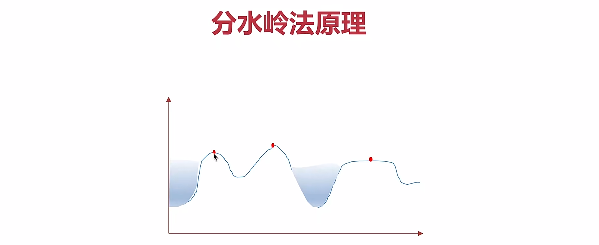
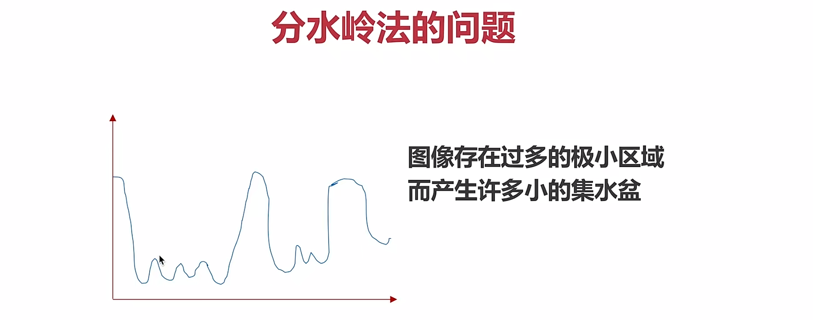
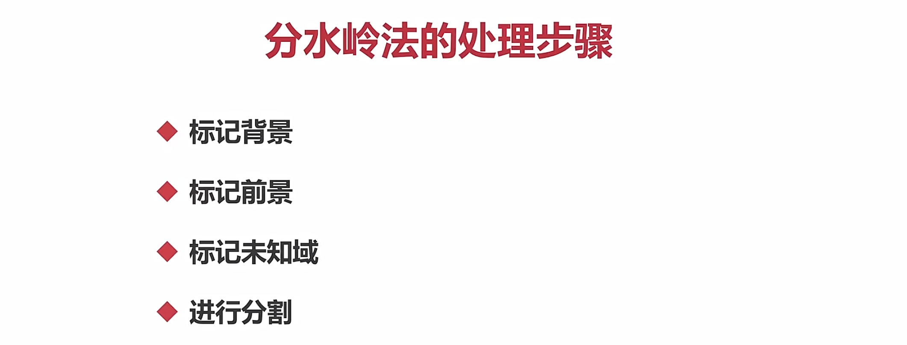
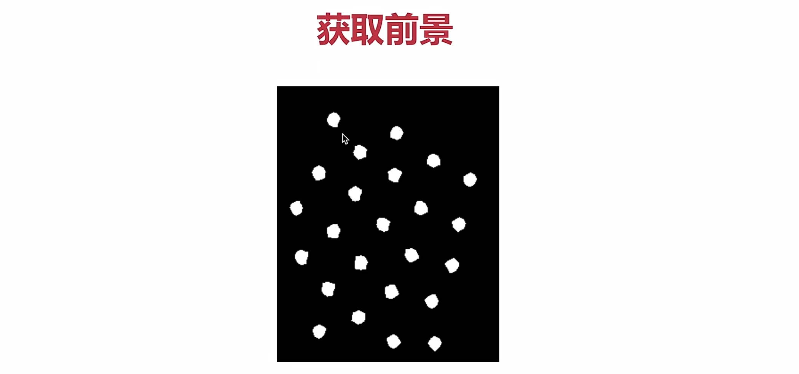
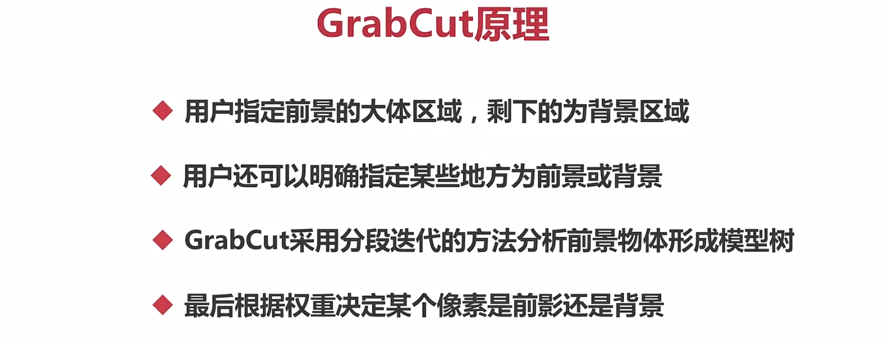
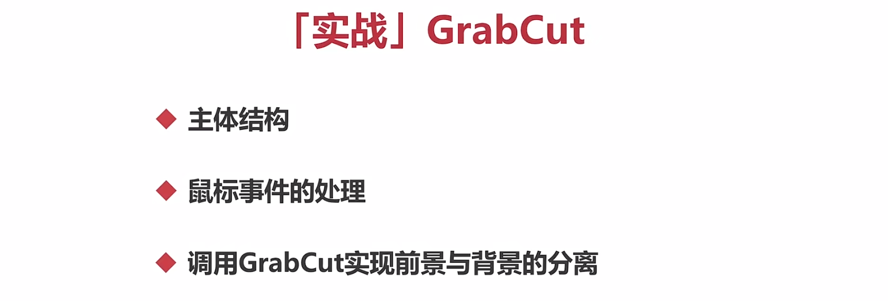
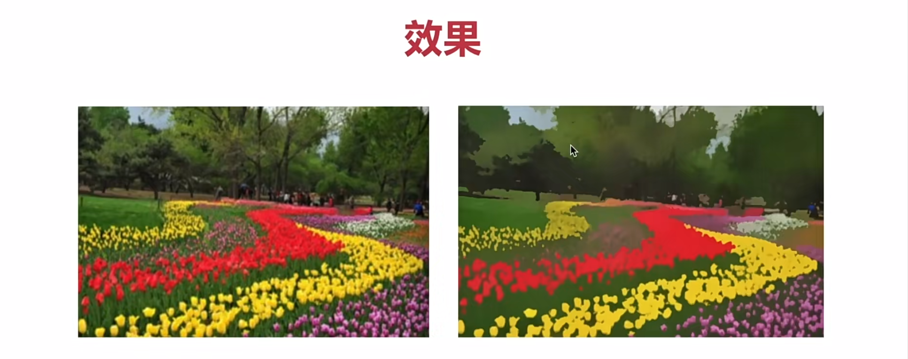
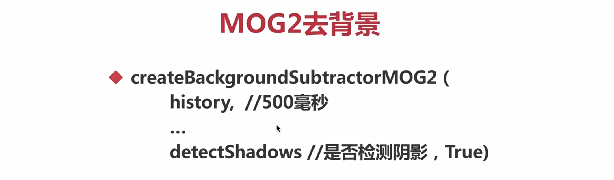
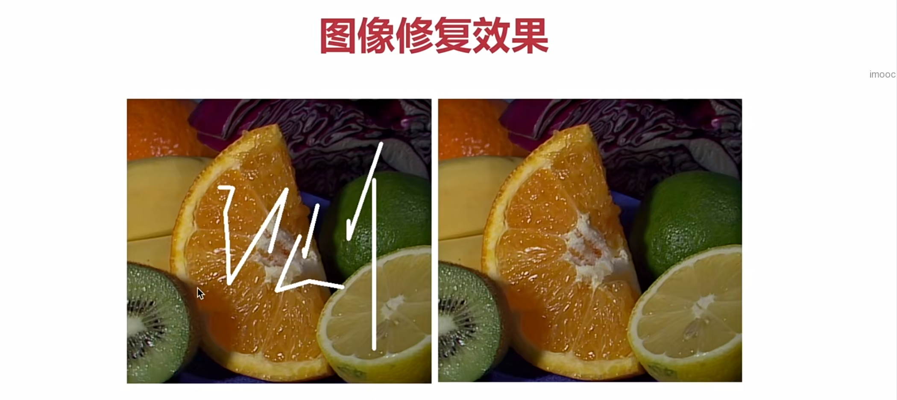

[TOC]


1、基本概念
===

概念：将前景物体从背景中分离出来
---

2、传统的图像分割方法
===

1）分水岭法
---

### watershed(img，masker)

masker，前景、背景设置不同的值用以区分他们








### 实战--使用分水岭法分割硬币




前景和背景之间有一个未知区域


```python
import cv2
import numpy as np
from matplotlib import pyplot as plt

#获取背景 
# 1. 通过二值法得到黑白图片
# 2. 通过形态学获取背景

img = cv2.imread('water_coins.jpeg')
gray = cv2.cvtColor(img, cv2.COLOR_BGR2GRAY)

ret, thresh =cv2.threshold(gray, 0, 255, cv2.THRESH_BINARY_INV + cv2.THRESH_OTSU)

#开运算
kernel = np.ones((3,3), np.int8)
open1 = cv2.morphologyEx(thresh, cv2.MORPH_OPEN, kernel, iterations = 2)

#膨胀
bg = cv2.dilate(open1, kernel, iterations = 1)

#获取前景物体
dist = cv2.distanceTransform(open1, cv2.DIST_L2, 5)

ret, fg = cv2.threshold(dist,0.7*dist.max(), 255, cv2.THRESH_BINARY)

# plt.imshow(dist, cmap='gray')
# plt.show()
# exit()

#获取未知区域
fg = np.uint8(fg)
unknow = cv2.subtract(bg, fg)

#创建连通域
ret, marker = cv2.connectedComponents(fg)

marker = marker + 1
marker[unknow==255] = 0

#进行图像分割
result = cv2.watershed(img, marker)

img[result == -1] = [0, 0, 255]

cv2.imshow("img", img)
cv2.imshow("unknow", unknow)
cv2.imshow("fg", fg)
cv2.imshow("bg", bg)
cv2.imshow("thresh", thresh)
cv2.waitKey()
```


2）GrabCut法 (通过交互的方式获得前景物体)
---

### 

### GrabCut原理



### 实战-按N或者0



```python
import cv2
import numpy as np

class App:

    flag_rect = False
    rect=(0, 0, 0, 0)
    startX = 0
    startY = 0

    def onmouse(self, event, x, y, flags, param):

        if event == cv2.EVENT_LBUTTONDOWN:
            self.flag_rect = True
            self.startX = x
            self.startY = y
            print("LBUTTIONDOWN")
        elif event == cv2.EVENT_LBUTTONUP:
            self.flag_rect = False
            cv2.rectangle(self.img, 
                            (self.startX, self.startY),
                            (x, y),
                            (0, 0, 255), 
                            3)
            self.rect = (min(self.startX, x), min(self.startY, y), 
                        abs(self.startX - x), 
                        abs(self.startY -y))

            print("LBUTTIONUP")
        elif event == cv2.EVENT_MOUSEMOVE:
            if self.flag_rect == True:
                self.img = self.img2.copy()
                cv2.rectangle(self.img, 
                                (self.startX, self.startY),
                                (x, y),
                                (255, 0, 0), 
                                3)
            print("MOUSEMOVE")  

        print("onmouse")

    def run(self):
        print("run...")

        cv2.namedWindow('input')
        cv2.setMouseCallback('input', self.onmouse)

        self.img = cv2.imread('./lena.png')
        self.img2 = self.img.copy()
        self.mask = np.zeros(self.img.shape[:2], dtype=np.uint8)
        self.output = np.zeros(self.img.shape, np.uint8)

        while(1):
            cv2.imshow('input', self.img)
            cv2.imshow('output', self.output)
            k = cv2.waitKey(100)
            if k == 27:
                break

            if k == ord('g'):
                bgdmodel = np.zeros((1, 65), np.float64)
                fgdmodel = np.zeros((1, 65), np.float64)
                cv2.grabCut(self.img2, self.mask, self.rect,
                            bgdmodel, fgdmodel,
                            1, 
                            cv2.GC_INIT_WITH_RECT)
            mask2 = np.where((self.mask==1)|(self.mask==3), 255, 0).astype('uint8')
            self.output = cv2.bitwise_and(self.img2, self.img2, mask=mask2)   
           
App().run()
```

3）MeanShift法(对色彩平滑处理)
---

### pyrMeanShiftFiltering(img，double sp，double sr，maxLevel=1，termcrit=TermCriteria...)



sp半径，sr色彩幅值

它会中和色彩分布相近的颜色，平滑色彩细节，侵蚀掉面积较小的颜色区域

它以图像上任一点p为圆心，半径为sp，色彩幅值为sr进行不断的迭代

```python
import cv2
import numpy as np

img = cv2.imread('key.png')

mean_img = cv2.pyrMeanShiftFiltering(img, 20, 30)

imgcanny = cv2.Canny(mean_img, 150, 300)

contours, _ = cv2.findContours(imgcanny, cv2.RETR_EXTERNAL, cv2.CHAIN_APPROX_SIMPLE)

cv2.drawContours(img, contours, -1, (0, 0, 255), 2)

cv2.imshow('img', img)
cv2.imshow('mean_img', mean_img)
cv2.imshow('canny', imgcanny)
cv2.waitKey()
```

4）背景扣除
---

### 原理

- 视频是一组连续的帧(一幅幅画组成)
- 帧与帧之间关系密切(GOP)
- 在GOP中，背景几乎是不变的

### MOG去背景(一般都是用默认值)

#### createBackgroundSubtractorMOG(...)


```python
import cv2
import numpy as np

cap = cv2.VideoCapture('./vtest.avi')
mog = cv2.bgsegm.createBackgroundSubtractorMOG()

while(True):
    ret, frame = cap.read()
    fgmask = mog.apply(frame)

    cv2.imshow('img',fgmask)

    k = cv2.waitKey(10) 
    if k ==27:
        break

cap.release()
cv2.destroyAllWindows()
```

混合高斯模型为基础的前景、背景分割算法

### MOG2(可算出阴影部分，同时减少噪点，如果采用默认值，则会延迟120帧，通过调整初始参考帧)





### GMG去背景


3、图像修复
===





```
import cv2
import numpy as np

img = cv2.imread('inpaint.png')
mask = cv2.imread('inpaint_mask.png', 0)

dst = cv2.inpaint(img, mask, 5, cv2.INPAINT_TELEA)

cv2.imshow('dst', dst)
cv2.imshow('img', img)

cv2.waitKey()
```