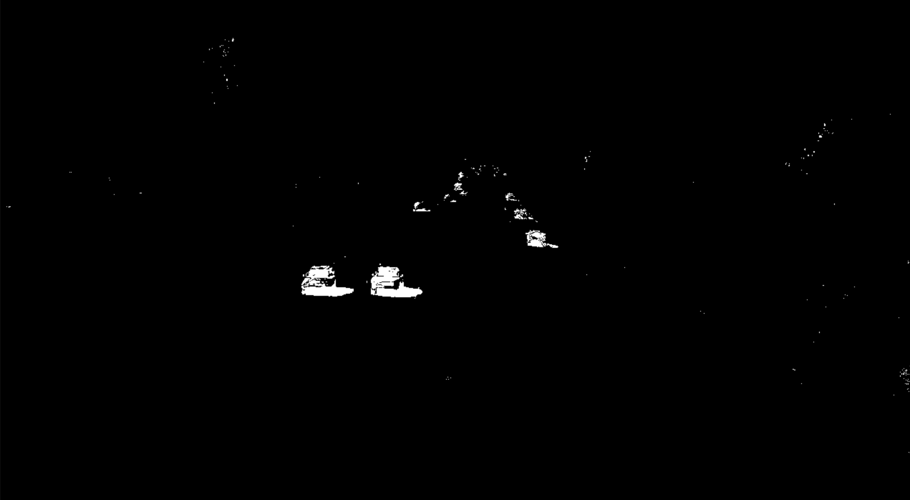
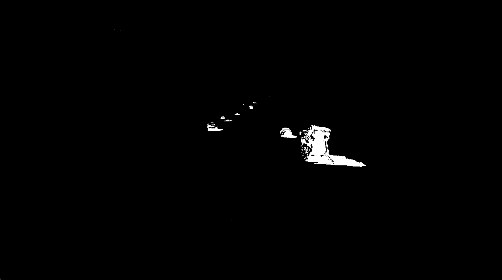

1 去背景
===

运动的物体为前景，静止的物体为背景，前景提取出来，背景去掉，然后经过去噪就可以识别出车辆

createBackgroundSubtractorMOG() 在视频中以时间轴为顺序，像素在一定范围内不发生变化，那他就是背景色

里面参数history代表预存多少时间的视频帧数



```python
import cv2
import numpy as np

cap = cv2.VideoCapture('video.mp4')

bgsubmog = cv2.bgsegm.createBackgroundSubtractorMOG() #生成一个对象

#将这一副副图画读取出来
while True:
    ret, frame = cap.read()
    if(ret == True):
        mask = bgsubmog.apply(frame) #对帧进行操作
        cv2.imshow('video', mask)

    key = cv2.waitKey(1)
    if(key == 27):
        break

cap.release()
cv2.destroyAllWindows()
```

下载pip install opencv-contrib-python

2 去噪
===

在去背景之前进行去噪

```python
import cv2
import numpy as np

cap = cv2.VideoCapture('video.mp4')

bgsubmog = cv2.bgsegm.createBackgroundSubtractorMOG()

#将这一副副图画读取出来
while True:
    ret, frame = cap.read()
    if(ret == True):
        #将原始图像进行灰度化
        cv2.cvtColor(frame, cv2.COLOR_BGR2GRAY)
        #去噪（高斯）
        blur = cv2.GaussianBlur(frame, (3,3), 5)
        #去背影
        mask = bgsubmog.apply(blur)
        cv2.imshow('video', mask)

    key = cv2.waitKey(1)
    if(key == 27):
        break

cap.release()
cv2.destroyAllWindows()
```

