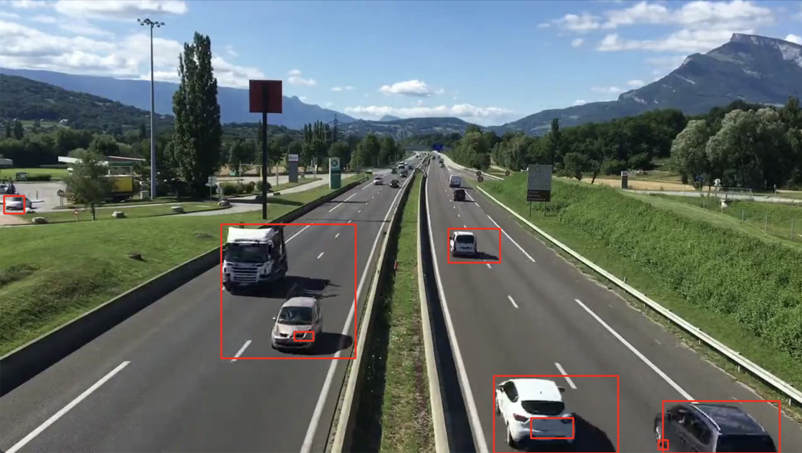

腐蚀膨胀，开操作，闭操作，顶帽黑帽

形态学的kernel通过getStructuringElement来获取，有矩形，椭圆形，这里用5x5的矩形，可以去掉较小的方块，比如说草，树叶

1、腐蚀， 去掉图中小斑块，对去掉背景的图进行腐蚀

2、要进行还原，进行3次膨胀，

3、用闭操作把物体里面的点给去掉

4、通过查找轮廓，找到移动物体

5、还要进行优化

```python
import cv2
import numpy as np

cap = cv2.VideoCapture('video.mp4')

bgsubmog = cv2.bgsegm.createBackgroundSubtractorMOG()

# #形态学kernel
kernel = cv2.getStructuringElement(cv2.MORPH_RECT, (5,5))

#将这一副副图画读取出来
while True:
    ret, frame = cap.read()
    if(ret == True):
        #灰度
        cv2.cvtColor(frame, cv2.COLOR_BGR2GRAY)
        #去噪（高斯）
        blur = cv2.GaussianBlur(frame, (3,3), 5)

        #去背影
        mask = bgsubmog.apply(blur)

        #腐蚀， 去掉图中小斑块，对去掉背景的图进行腐蚀
        erode = cv2.erode(mask, kernel)

        #膨胀， 还原放大
        dilate = cv2.dilate(erode, kernel, iterations = 3)

        #闭操作，去掉物体内部的小块
        close = cv2.morphologyEx(dilate, cv2.MORPH_CLOSE, kernel)
        close = cv2.morphologyEx(close, cv2.MORPH_CLOSE, kernel)

        # 查找轮廓
        # 输入参数：我们要用哪种类型查找轮廓，存储点的类型
        cnts, h = cv2.findContours(close, cv2.RETR_TREE, cv2.CHAIN_APPROX_SIMPLE)
        # 遍历出轮廓，i索引值，c一个个轮廓
        for (i, c) in enumerate(cnts):
             (x,y,w,h) = cv2.boundingRect(c) # 最外层的矩形来画轮廓，x，y宽和高
             #到这里都是有效的车，画到frame，坐标，用x+w,y+h画出轮廓， ，线宽
             cv2.rectangle(frame, (x, y), (x+w, y+h), (0,0,255), 2)

        cv2.imshow('video', frame)
        # cv2.imshow('erode', erode)

    key = cv2.waitKey(1)
    if(key == 27):
        break
+w,
cap.release()
cv2.destroyAllWindows()
```



还要进行优化