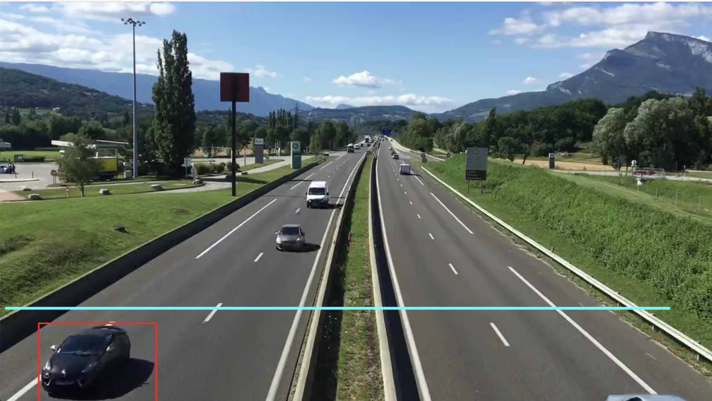

现在我们要把车上的物件给他去掉，只留下跟车的外形相关的，这样才能判断他是一辆车

对图形比较小的矩形直接给过滤掉

1、对车辆的宽高进行判断 高度宽度需要大于等于90，以验证是否是有效的车辆

2、存车的中心点，便于计数

3、画出一个线，线高550，这个视频有720

4、用cars=[]存放有效车辆的数组，carno统计数量，

```python
import cv2
import numpy as np

min_w = 90
min_h = 90

#计算中心点
def center(x, y, w, h):
    x1 = int(w/2)
    y1 = int(h/2)
    cx = x + x1
    cy = y + y1

    return cx, cy

#检测线的高度
line_high = 550

#线的偏移
offset = 7

#统计车的数量
carno =0

#存放有效车辆的数组
cars = []

cap = cv2.VideoCapture('video.mp4')

bgsubmog = cv2.bgsegm.createBackgroundSubtractorMOG()

# #形态学kernel
kernel = cv2.getStructuringElement(cv2.MORPH_RECT, (5,5))

#将这一副副图画读取出来
while True:
    ret, frame = cap.read()
    if(ret == True):
        #灰度
        cv2.cvtColor(frame, cv2.COLOR_BGR2GRAY)
        #去噪（高斯）
        blur = cv2.GaussianBlur(frame, (3,3), 5)

        #去背影
        mask = bgsubmog.apply(blur)

        #腐蚀， 去掉图中小斑块
        erode = cv2.erode(mask, kernel)

        #膨胀， 还原放大
        dilate = cv2.dilate(erode, kernel, iterations = 3)

        #闭操作，去掉物体内部的小块
        close = cv2.morphologyEx(dilate, cv2.MORPH_CLOSE, kernel)
        close = cv2.morphologyEx(close, cv2.MORPH_CLOSE, kernel)

        #查找轮廓
        cnts, h = cv2.findContours(close, cv2.RETR_TREE, cv2.CHAIN_APPROX_SIMPLE)

        #画一条检测线 第一个点x=10，y=550  第二个点x=1200，y=550，宽度3，就将这个线画出来了
        cv2.line(frame, (10, line_high), (1200, line_high), (255, 255, 0), 3)
        for (i, c) in enumerate(cnts):
             (x,y,w,h) = cv2.boundingRect(c)

             #对车辆的宽高进行判断
             #以验证是否是有效的车辆
             isValid = ( w >= min_w ) and ( h >= min_h)
             if( not isValid):
                 continue
             #到这里都是有效的车
             cv2.rectangle(frame, (x, y), (x + w, y + h), (0, 0, 255), 2)
              #存车的中心点，便于计数
             cpoint = center(x, y, w, h)
             cars.append(cpoint)
             for (x, y) in cars: #对于这些车辆进行判断
                 #要有一条线
                 #有范围 6
                 #从数组中移去，如果车是落在线的有效区域之内
                 if( (y > line_high - offset) and (y < line_high + offset ) ):
                     carno +=1
                     cars.remove((x , y )) # 把车从数组中移除掉
                     print(carno)


        cv2.imshow('video', frame)
        # cv2.imshow('erode', erode)

    key = cv2.waitKey(1)
    if(key == 27):
        break

cap.release()
cv2.destroyAllWindows()
```

